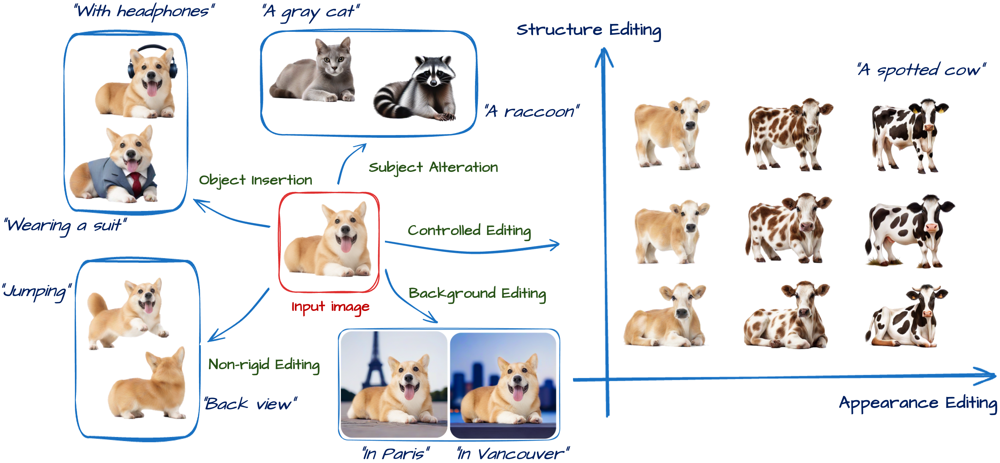

<div align="center">

<h1>Cora: Correspondence-aware image editing using few step diffusion</h1>

<div>
    <a href='https://alimohammadiamirhossein.github.io/' target='_blank'>Amir Alimohammadi</a><sup>1</sup>&emsp;
    <a href='https://aryanmikaeili.github.io/' target='_blank'>Aryan Mikaeili</a><sup>1</sup>&emsp;
    <a href='https://sauradip.github.io/' target='_blank'>Sauradip Nag</a><sup>1</sup>&emsp;
    <a href='https://webdocs.cs.ualberta.ca/~hassanpo/' target='_blank'>Negar Hassanpour</a><sup>2</sup>&emsp; 
    <a href='https://taiya.github.io/' target='_blank'>Andrea Tagliasacchi</a><sup>1, 3, 4</sup>&emsp; <br>
    <a href='https://www.sfu.ca/~amahdavi' target='_blank'>Ali Mahdavi Amiri</a><sup>1</sup>&emsp;
</div>
<div>
    <sup>1</sup><b>Simon Fraser University</b>
    <sup>2</sup>Huawei
    <sup>3</sup>University of Toronto
    <sup>4</sup>Google DeepMind
        &emsp; <br>
</div>
<div>
    Accepted at <b>SIGGRAPH 2025</b>
</div>

<h3 align="center">
  <a href="https://arxiv.org/" target='_blank'>Paper</a> |
  <a href="https://cora-edit.github.io/" target='_blank'>Project Page</a> 
</h3>
</div>

**Cora** is a new image editing method that enables flexible and accurate edits, such as pose changes, object insertions, and background swaps, using only four diffusion steps. Unlike other fast methods that often produce visual artifacts, Cora uses *semantic correspondences* between the original and edited images to preserve structure and appearance where necessary. It is fast, controllable, delivers high-quality edits, and requires no additional training.


<div align="center">
<table>
<tr>
    <td></td>
</tr>
</table>
</div>

## Why Cora?

* **Few-step editing** – delivers high-quality results in just 4 diffusion steps, making it fast and memory-efficient.  
* **Structure-aware** – *Correspondence-aware Latent Correction* (CLC) aligns noise terms to the target layout, eliminating ghosting artifacts.  
* **Appearance control** – *Attention Interpolation* lets you blend source appearance with the prompt via a controllable parameter (α).  
* **Structure control** – *Query Matching* maintains or relaxes spatial layout via a controllable parameter (β).  
* **Plug-and-play** – built on 🤗 *Diffusers*; works with any Stable-Diffusion-compatible model.  

If Cora helps your research, please consider starring ⭐ the repo!


# Overview

The main parts of the framework are as follows:

```
Cora
├── main.py                            
├── model                    
│   ├── directional_attentions.py     -- attention for controlling appearance and layout
|   ├── modules
│   │   ├── dift_utils.py             -- feature alignment and patch-based latent matching utilities        
│   │   ├── new_object_detection.py   -- new object detection for content-adaptive interpolation            
│   │   ├── ...     
|   ├── ...
├── src
|   ├── ddpm_step.py                  -- single-step denoising for DDPM schedulers      
|   ├── ddpm_inversion.py             -- correspondence-aware latent correction
├── scripts
|   ├── edit.sh                       -- script for image editing
|   ├── config.sh                     -- configuration settings
|   ├── prompts
│   │   ├── p.json                    -- image editing prompts, alpha/beta, and masks 
|   ├── ...   
├── utils                    
|   ├── args.py                       -- define, parse, and update command-line arguments
|   ├── utils.py
|   ├── ...   
├── visualization                    
|   ├── image_utils.py                -- resizing, saving images, and handling prompts.
|   ├── draw_box.py                   -- interactive bounding box drawing tool
```
# Getting Started  
To get started as quickly as possible, follow the instructions in this section. This should allow you train a model from scratch, evaluate your pretrained models, and produce visualizations.  

### Dependencies
- Python 3.8+
- PyTorch == 2.5.1 **(Please make sure your pytorch version is atleast 2.1)**
- A modern NVIDIA GPU (e.g., 3090 RTX or newer)
- Hugging-Face Diffusers
- transformers == 4.43.3

### Environment Setup
You can create and activate a Conda environment like below:
```shell script
conda create -n <envname> python=3.8
conda activate <envname>  
pip install --upgrade pip
```

### Requirements  
Furthermore, you just have to install all the packages you need:  
```shell script  
pip install -r requirements.txt  
```  

# Usage

### Edit

To perform inference, place your images in the `dataset` folder, create a JSON file with the source and target prompts (similar to our `dataset/dataset.json` file), and then run:

```
bash scripts/edit.sh
```

#### 🔧 Advanced Configuration & Arguments

For detailed explanations of all configurable parameters, JSON formatting, and mask extraction, see the [Arguments & Parameters Guide](./assets/ARGS_README.md).


### Gradio demo
Alternatively, if you want to experiment using [Gradio](https://www.gradio.app/)'s UI, run:
```
python app.py 
```


## Citation
If you find this project useful for your research, please use the following BibTeX entry.
```
@misc{alimohammadi2025Cora,
      title={Cora: Correspondence-aware image editing using few step diffusion}, 
      author={Amirhossein Alimohammadi and Aryan Mikaeili and Sauradip Nag and Negar Hassanpour and Andrea Tagliasacchi and Ali Mahdavi Amiri},
      year={2025},
}
```